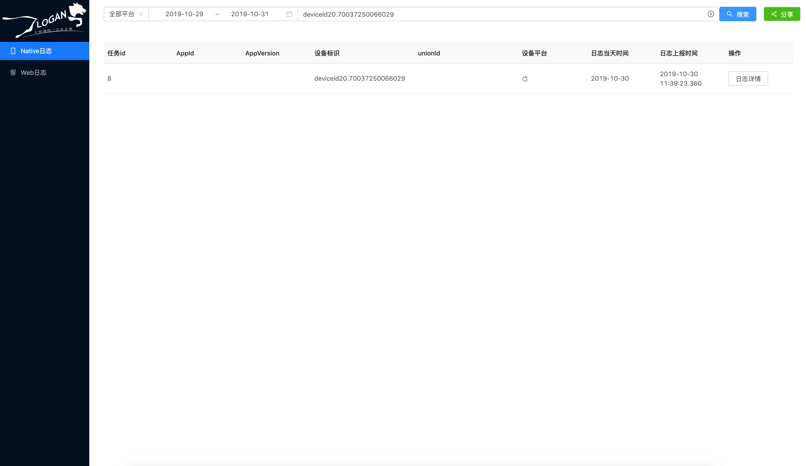
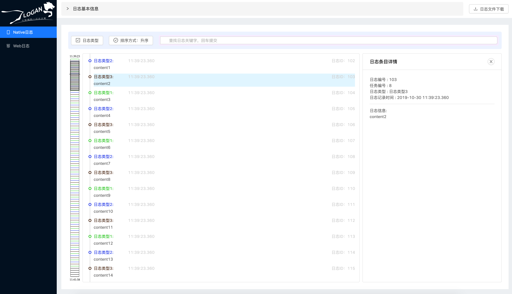
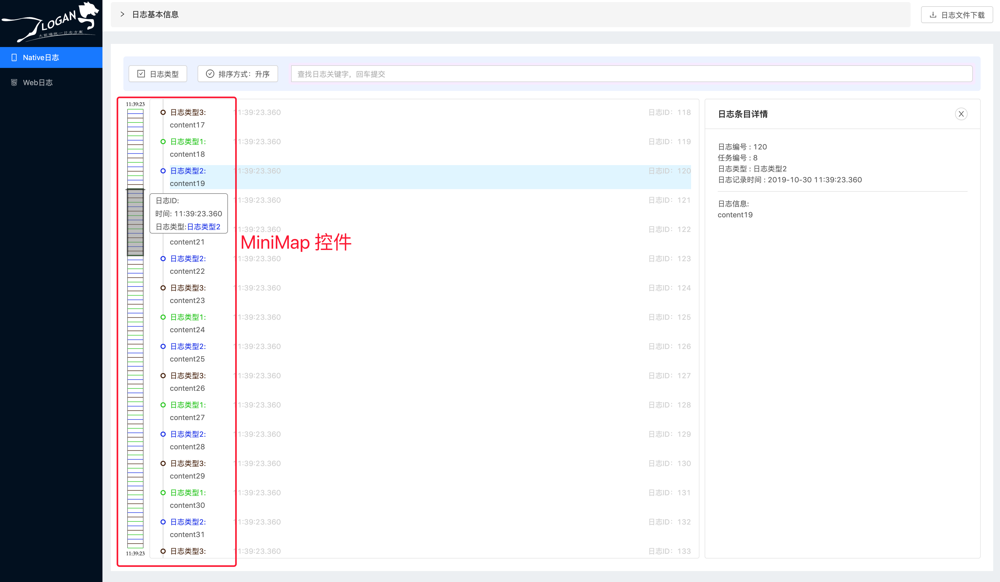

# Logan Website

[中文版](./README_CN.md)

Logan Website provide a convenient way for developers to scan and search logs uploaded from App and Web.

More details？[Logan：美团点评的开源移动端基础日志库](https://tech.meituan.com/2018/10/11/logan-open-source.html)

## Getting Started

### Prerequest
- Node: ^10.15.3
- yarn: ^1.15.2 或 npm ^6.12.0


### Installation

#### Local

first, clone the repository

create `.env.development` file at root of LoganSite.
Specify environment variable `API_BASE_URL` to the location of server:
```bash
API_BASE_URL=http://location/to/your/server:port
```

then, Run commands below:
```
$ cd $LOGAN_SITE
$ npm install
$ npm run start
```
or
```
$ cd $LOGAN_SITE
$ yarn
$ yarn start
```

#### Screenshot




#### Build

first, clone the repository.

modify the line 4 in LoganSite/src/common/api.js,
make `BASE_URL` variable point to the location of server：
```javascript
const BASE_URL = "http://location/to/your/server:port"
```

then, Run commands below:

```
$ cd $LOGAN_SITE
$ npm install
$ npm run build
```
or
```
$ cd $LOGAN_SITE
$ yarn
$ yarn build
```

## Features

The Logan website provides browsing and retrieval capabilities for reported logs from clients (Android, iOS, and Web):
- Upload Task Retrieval: Find the log upload task based on the log report time, deviceid, or unionid.
- Upload Task Overview: an overview of all log item recorded in a single upload task.
- Log Type Filtering: Filters all log items in a single task based on log type.
- Keyword Filtering: Filters all log items in a single task based on keywords.
- Quickly locate a single log: Provides a MiniMap component that quickly locates a single log based on log type and recording time.
- Single log detail display: shows a log original record.

### ⭐️**The MiniMap Component**

Facing the large number of logs stored on the client, traditional way of paging table with filter condition is difficult to use for developer to find useful information.Therefore, Logan designed a MiniMap component trying to solve this problem. This control has the following features:
- Visually show the log type: draw lines in different colors to represent different types of logs
- Conveniently view log summary: mouse over to any line, showing log type and logging time information
- Quickly navigate to the target log: Click anywhere to quickly view the log details




## Project Structrue
```
LOGAN_SITE
├── src
│   ├── app.js
│   ├── app.scss
│   ├── app.test.js
│   ├── index.js
│   ├── store.js
│   ├── common          // common components and global functions
│   │   ├── components
│   │   ├── adapter.js
│   │   ├── api.js
│   │   ├── color.js
│   │   ├── time.js
│   │   └── util.js
│   ├── consts          // constants will use in this project
│   └── views
│       ├── components  // page level components to reuse
│       │   ├── list-page
│       │   │   ├── components  // block level components in page
│       │   │   ├── index.js
│       │   │   └── style.scss
│       │   └── log-detail-page
│       │       ├── components  // block level components in page
│       │       ├── index.js
│       │       └── style.scss
│       ├── native-list
│       │   ├── index.js
│       │   └── redux
│       ├── native-log-detail
│       │   ├── index.js
│       │   └── redux
│       ├── web-detail
│       │   ├── index.js
│       │   └── redux
│       └── web-list
│           ├── index.js
│           └── redux
├── config    // webpack configs
├── public
├── scripts   // npm scripts
├── package.json
├── README.md
└── yarn.lock
```

## License
Logan is licensed under the MIT License - see the [LICENSE](https://github.com/Meituan-Dianping/Logan/blob/master/LICENSE) file for details.