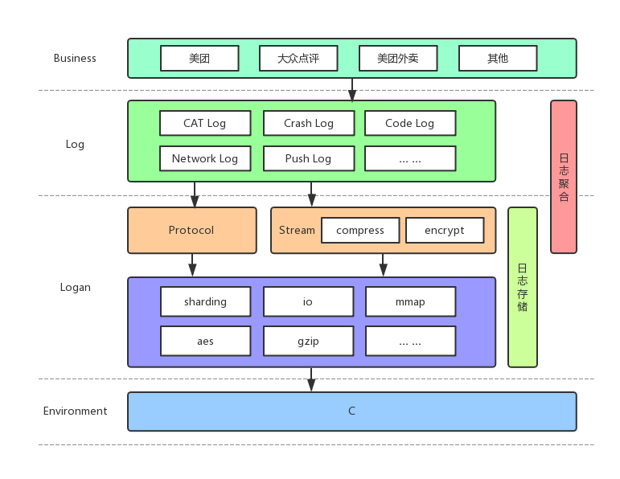
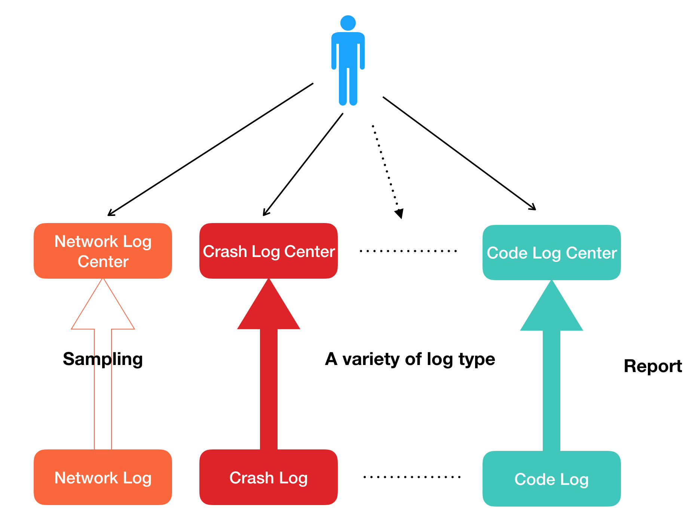
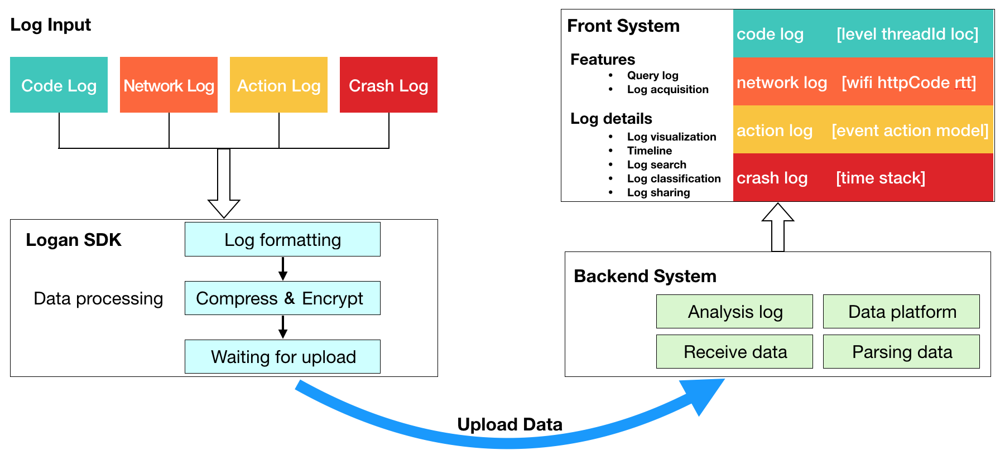
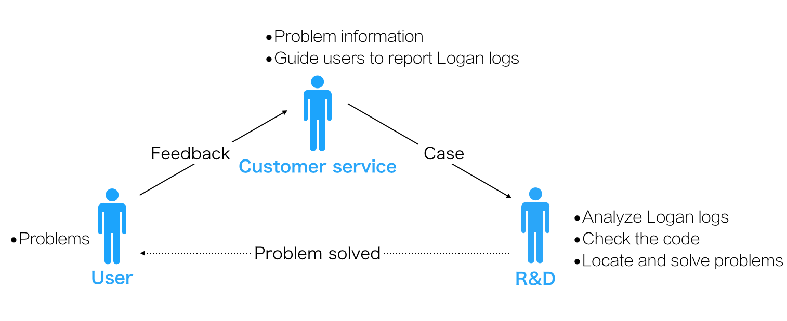
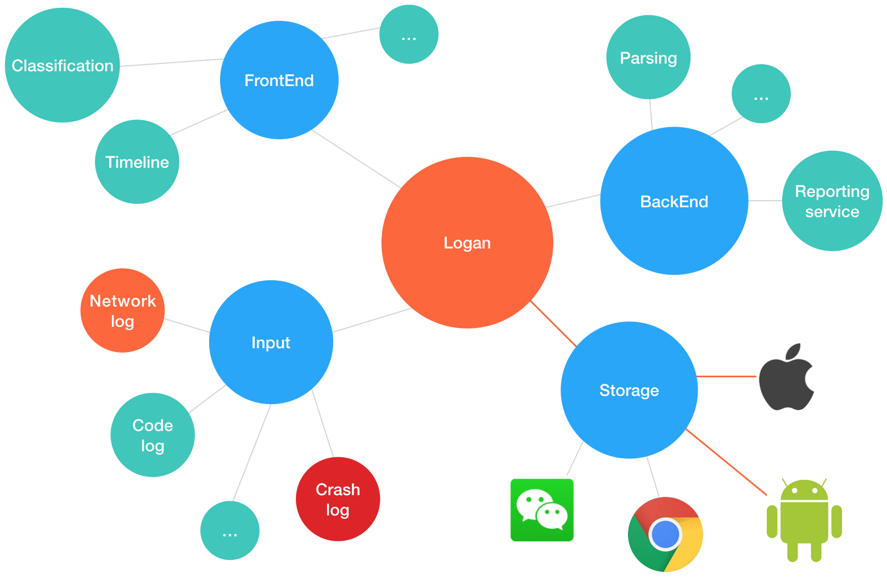

# Logan

[](https://raw.githubusercontent.com/Meituan-Dianping/Logan/master/LICENSE)
[](https://github.com/Meituan-Dianping/Logan/releases)
[](https://github.com/Meituan-Dianping/Logan/pulls)
[](https://github.com/Meituan-Dianping/Logan/wiki)

Logan是美团点评集团移动端基础日志组件。名称是Log和An的组合，代表个体日志服务，同时也是金刚狼大叔的大名。



**Logan 承载着各种日志的聚合、存储、分析，作为基础日志库，Logan 已经接入了集团众多日志系统，例如端到端日志、用户行为日志、代码级日志、崩溃日志等。**

# Getting started

## Android

### Prerequisites

如果你想编译源代码，请确保NDK版本不高于**16.1.4479499**。

### Installation

在项目的`build.gradle`文件中添加：

```groovy
compile 'com.dianping.android.sdk:logan:1.2.1'
```

### Usage

在使用之前，必须初始化Logan，例如：

```java
LoganConfig config = new LoganConfig.Builder()
        .setCachePath(getApplicationContext().getFilesDir().getAbsolutePath())
        .setPath(getApplicationContext().getExternalFilesDir(null).getAbsolutePath()
                + File.separator + "logan_v1")
        .setEncryptKey16("0123456789012345".getBytes())
        .setEncryptIV16("0123456789012345".getBytes())
        .build();
Logan.init(config);
```

初始化之后，就可以愉快的写日志了，例如这样写一条日志：

```java
Logan.w("test logan", 1);
```

Logan.w方法有两个参数，详解如下：

- **String log**：写入的日志内容；
- **int type**：写入的日志类型，这非常重要，在下文的最佳实践内容会详细讲述如何优雅利用日志类型参数。

如果你想立即写入日志文件，需要调用flush方法：

```java
Logan.f();
```

如果你想查看所有日志文件的信息，需要调用getAllFilesInfo方法：

```java
Map<String, Long> map = Logan.getAllFilesInfo();
```

其中key为日期，value为日志文件大小（Bytes）。

#### Upload

Logan内部提供了日志上传机制，对需要上传的日志做了预处理操作。如果你需要上传日志功能，首先需要实现一个自己的SendLogRunnable：

```java
public class RealSendLogRunnable extends SendLogRunnable {

    @Override
    public void sendLog(File logFile) {
      // logFile为预处理过后即将要上传的日志文件
      // 在此方法最后必须调用finish方法
      finish();
      if (logFile.getName().contains(".copy")) {
				logFile.delete();
			}
    }
}
```

**注意：在sendLog方法的最后必须调用finish方法**。如上面代码所示。

最后需要调用Logan的send方法：

```java
Logan.s(date, mSendLogRunnable);
```

其中第一个参数为日期数组（yyyy-MM-dd）。

## iOS & macOS

### Installation

Logan支持以CocoaPods方式将Logan库引入到项目中。

#### Podfile

在Xcode项目中引入Logan，`podfile`添加Logan。

```ruby
source 'https://github.com/CocoaPods/Specs.git'
platform :ios, '8.0'

target 'TargetName' do
pod 'Logan', '~> 1.2.2'
end
```

然后运行以下命令：

```bash
$ pod install
```

### Logan Init

在使用之前，必须初始化Logan，例如：

```objc
#import "Logan.h"

NSData *keydata = [@"0123456789012345" dataUsingEncoding:NSUTF8StringEncoding]; 
NSData *ivdata = [@"0123456789012345" dataUsingEncoding:NSUTF8StringEncoding];
uint64_t file_max = 10 * 1024 * 1024;
// logan初始化，传入16位key，16位iv，写入文件最大大小(byte)
loganInit(keydata, ivdata, file_max);

#if DEBUG
loganUseASL(YES);
#endif
```

### Usage

写入一条日志：
```objc
logan(1, @"this is a test");
```

## Log parsing
### java
将Logan/parser-java 拷贝到项目中。

解析日志数据
```java
new LoganParser(Key16.getBytes(),Iv16.getBytes()).parse(InputStream, OutputStream)
```
### node.js
请参考 Example/Logan-Server/server.js 实现。

## Demo

[How to use demo](https://github.com/Meituan-Dianping/Logan/wiki/How-to-use-demo)

[Log protocol](https://github.com/Meituan-Dianping/Logan/wiki/Log-protocol)
# Best Practices

在Logan面世之前，日志系统是相对分散的。



简单来说，传统的思路是通过搜集散落在各系统的日志拼凑出问题出现的场景，而新的思路是从用户产生的所有日志中聚合分析，寻找出现问题的场景。

Logan核心体系由四大模块构成：

- 日志输入
- 日志存储
- 后端系统
- 前端系统



新的个案分析流程如下：



# Article

[美团点评移动端基础日志库 — Logan](https://tech.meituan.com/Logan.html)

[Logan：美团点评的开源移动端基础日志库](https://tech.meituan.com/logan_open_source.html)

# Feature

未来我们会提供基于Logan大数据的数据平台，包含机器学习、疑难日志解决方案、大数据特征分析等高级功能。

最后，我们希望提供更加完整的一体化个案分析生态系统。



| Module | Open Source | Processing | Planning |
| :------: | :--: | :-----: | :-: |
| iOS & macOS  |   √  |        |    |
| Android | √ |  |  |
| Web |  | √ |  |
| Mini Programs |  | √ |  |
| Back End |  |  | √ |
| Front End |  |  | √ |

# Contributing

**关于贡献PRs和issue的更多信息，请参考[贡献指南](./CONTRIBUTING.md)**

# Authors

* **白帆** - 核心开发者 - [baitian0521](https://github.com/baitian0521)

* **曹立成** - 核心开发者 - [Richard-Cao](https://github.com/Richard-Cao)

* **姜腾** - 核心开发者 - [jiangteng](https://github.com/jiangteng)

* **杨向南** - 核心开发者 - [yangxiangnan](https://github.com/yangxiangnan)

* **马小军** - 核心开发者 - [Mr-xiaojun](https://github.com/Mr-xiaojun)

[贡献者列表](https://github.com/Meituan-Dianping/Logan/graphs/contributors)

# License

Logan项目采用MIT许可协议 - 详细内容请查看[LICENSE](https://github.com/Meituan-Dianping/Logan/blob/master/LICENSE)。

# Acknowledgments

- [mbedtls](https://github.com/ARMmbed/mbedtls)
- [cJSON](https://github.com/DaveGamble/cJSON)
